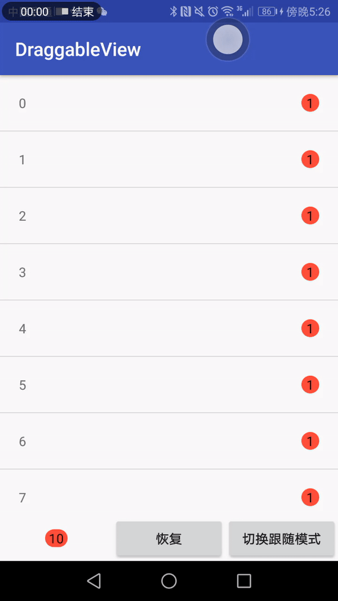

Draggable View
========

这是一个支持拖拽销毁的通知视图
* 支持拖拽过程中的粘连效果
* 拖拽有效后的爆炸动画
* 拖拽无效后的减震回弹动画
* 设置拖拽视图的跟随者与跟随模式

具体效果：


## 开始使用

### 安装

在模块的`build.gradle`添加：
```groovy
dependencies {
    implementation 'com.github.tablebird:draggable-view:0.1.0'
}
```

### 示例代码

##### 在视图资源文件中使用

```xml
            <com.tablebird.drag.DraggableView
                android:id="@+id/tip_summary"
                android:layout_width="wrap_content"
                android:layout_height="wrap_content"
                app:followDisappearMode="trailing" //设置更随模式
                app:draggableEnable="true" //是否启用拖拽
                ...
                android:gravity="center"/>
```


#### 设置拖拽监听

```java
	DraggableView draggableView = findViewById(R.id.tip_summary);
	draggableView.setOnDragCompeteListener(new DraggableView.OnDragListener() {
            @Override
            public void onDragComplete(DraggableView draggableView) {
                //拖拽效果有效回调
            }

            @Override
            public void onDisappearComplete(DraggableView draggableView) {
                //拖拽完成后销毁动画播放结束回调
            }
        });
```

## License

Licensed under the Apache License, Version 2.0 (the "License");
you may not use this file except in compliance with the License.
You may obtain a copy of the License at

   http://www.apache.org/licenses/LICENSE-2.0

Unless required by applicable law or agreed to in writing, software
distributed under the License is distributed on an "AS IS" BASIS,
WITHOUT WARRANTIES OR CONDITIONS OF ANY KIND, either express or implied.
See the License for the specific language governing permissions and
limitations under the License.